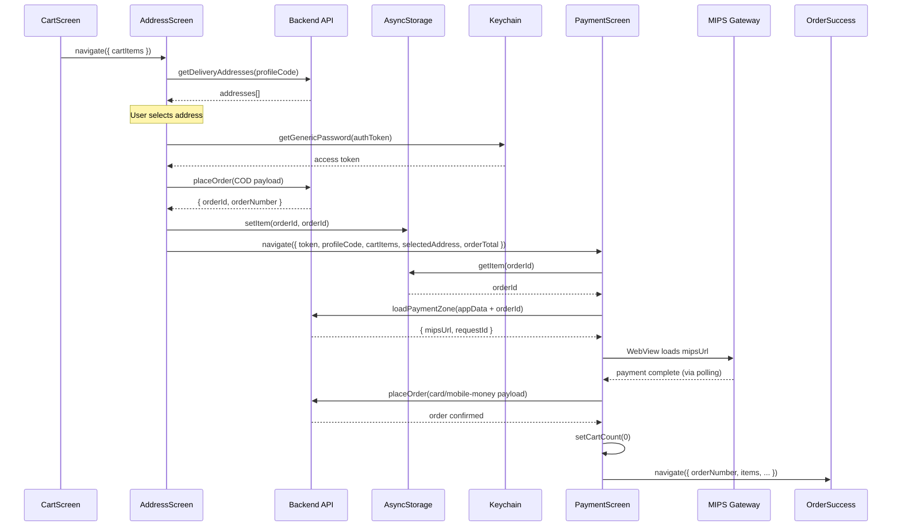

# AddressScreen + PaymentScreen — Audit & Remediation Plan

## Architecture Context

The checkout flow spans two screens:

```
CartScreen → AddressScreen → [placeOrder API] → PaymentScreen → OrderSuccess
```

The `placeOrder` API must be called on **AddressScreen** (before navigating to PaymentScreen) because:

1. **PaymentScreen** reads `orderId` from AsyncStorage on mount (line 91) to initialise the MIPS payment zone
2. **PaymentScreen** calls `placeOrder` again in `finaliseOrder` only **after** payment is confirmed — this finalises the order with the actual payment details (card/mobile-money)
3. The `placeOrder` payload on AddressScreen uses `PaymentModes: 1` (COD placeholder); PaymentScreen's `finaliseOrder` uses `PaymentModes: 2` (card/online) with real MIPS payment details

---

## AddressScreen Issues

### A. `buyProducts` is commented out (lines 259-373)

The entire `placeOrder` → store orderId → navigate flow is commented out. The footer button at line 549 references `buyProducts`, which is **undefined** — clicking "Place Order" will throw a `ReferenceError`.

**Fix:** Uncomment and adapt `buyProducts` to:
1. Call `placeOrder` with COD payload (`PaymentModes: 1`)
2. Store the returned `orderId` in AsyncStorage under a new `STORAGE_KEYS.orderId` key
3. Read auth `token` from Keychain/AsyncStorage
4. Navigate to `EcomPayment` with all required params instead of `OrderSuccess`

### B. `navigateToPayment` is incomplete (lines 249-257)

References `token`, `cartItems`, `total` — none defined in scope. Never called.

**Fix:** Remove this dead function. The restored `buyProducts` handles navigation.

### C. Missing `STORAGE_KEYS.orderId`

`src/config/storageKeys.ts` has no `orderId` key. PaymentScreen uses `STORAGE_KEYS.orderId ?? 'orderid'` as a fallback, which violates the "no bare string literals" rule.

**Fix:** Add `orderId: 'orderId'` to `STORAGE_KEYS`.

### D. Missing `token` for PaymentScreen navigation

PaymentScreen requires `token` in route params (for MIPS auth headers). AddressScreen currently doesn't read the auth token.

**Fix:** Read token from Keychain using `STORAGE_KEYS.authToken` before navigating.

### E. `useEffect` instead of `useFocusEffect`

CLAUDE.md prescribes `useFocusEffect(useCallback(...))` with cancelled ref for data fetching. AddressScreen uses `useEffect`.

**Fix:** Convert to `useFocusEffect` pattern.

---

## PaymentScreen Issues

### A. Broken imports (lines 15-19)

```typescript
// CURRENT (broken — neither file exists):
import { authInstance } from '../Components/axiosInstances';
import { MIPS_LOAD_PAYMENT_ZONE, MIPS_GET_PAYMENT_STATUS } from '../Components/endpoints';

// SHOULD BE:
import axiosInstance from '../api/axiosInstance';
import { paymentEndpoints } from '../api/endpoints';
```

**Fix:** Replace with correct imports. Replace all `authInstance.post(MIPS_LOAD_PAYMENT_ZONE, ...)` with `axiosInstance.post(paymentEndpoints.loadPaymentZone, ...)` and `authInstance.post(MIPS_GET_PAYMENT_STATUS, ...)` with `axiosInstance.post(paymentEndpoints.getPaymentStatus, ...)`.

### B. Fragile response parsing (line 168)

```typescript
const result = JSON.parse(response.request.response);
```

This reads the raw XHR responseText and manually JSON.parses it. The `axiosInstance` returns `response.data` as the already-parsed body.

**Fix:** Use `response.data` directly: `const result = response.data;`

Same issue on line 263: `JSON.parse(statusResponse.request.response)` → use `statusResponse.data`.

### C. Hardcoded hex colors and raw typography (entire StyleSheet, lines 513-567)

Violates CLAUDE.md rules: "Never hardcode hex colors, raw spacing, or raw font sizes. Always use tokens."

Every style uses raw strings: `'#FFFFFF'`, `'#D32F2F'`, `'#1A237E'`, `'#F5F5F5'`, `'#555'`, `'#DEDEDE'`, `'#888'`, `'#444'`. Font sizes are raw numbers. No `Type.*` presets.

**Fix:** Replace all colors with design tokens (`Colors.*`), all font styles with `Type.*` presets and `FontFamily.*`.

### D. Bare string literal `'orderid'` (line 91)

```typescript
await AsyncStorage.getItem(STORAGE_KEYS.orderId ?? 'orderid');
```

After adding `orderId` to `STORAGE_KEYS`, this becomes simply `STORAGE_KEYS.orderId`.

### E. Missing `STORAGE_KEYS` import (not imported at all)

PaymentScreen doesn't import `STORAGE_KEYS` but uses it on line 91. It imports `STORAGE_KEYS` from `'../config/storageKeys'` (line 24) — wait, it does import it. Checking... yes, line 24 has the import. OK, that's fine once we add the key.

### F. `navigation.goBack()` is used in many failure paths

After payment expiry/cancellation/failure, the screen calls `navigation.goBack()`. This sends the user back to AddressScreen, which may have stale state.

**Fix:** After goBack, AddressScreen should re-fetch on focus (which it will after converting to `useFocusEffect`).

---

## Plan of Action

### Step 1: Add `orderId` to `STORAGE_KEYS`
**File:** `src/config/storageKeys.ts`
- Add `orderId: 'orderId'` entry

### Step 2: Fix AddressScreen
**File:** `src/screens/AddressScreen.tsx`

1. **Add imports:** `* as Keychain` from `react-native-keychain`, `axiosInstance` (for token read isn't needed — use Keychain directly)
2. **Uncomment and adapt `buyProducts`:**
   - Validate selectedAddressCode, cartItems, profileCode
   - Build orderDetails with org-grouping (currently commented out, lines 284-313)
   - Build PlaceOrderInterface payload with `PaymentModes: 1` (COD)
   - Call `placeOrder(payload)`
   - On success: store orderId in AsyncStorage, read auth token from Keychain, navigate to `EcomPayment`
   - On failure: set `orderError`
3. **Delete `navigateToPayment`** (lines 249-257) — dead code
4. **Convert `useEffect` → `useFocusEffect`** for address fetching (lines 187-191)
5. **Change button `onPress`** from `buyProducts` to the restored `buyProducts` (line 549 — already correct once restored)
6. **Add `token` state:** Read from Keychain in the buyProducts flow

### Step 3: Fix PaymentScreen
**File:** `src/screens/PaymentScreen.tsx`

1. **Fix imports (lines 15-19):** Replace with correct paths
2. **Replace all `authInstance` → `axiosInstance`** and endpoint constants
3. **Fix response parsing (line 168, 263):** Use `response.data` directly
4. **Replace hardcoded styles (lines 513-567):** Use design tokens
5. **Add `STORAGE_KEYS` import correction** (checks out — already imported at line 24, but ensure it's correct)
6. **Replace `STORAGE_KEYS.orderId ?? 'orderid'` → `STORAGE_KEYS.orderId`** (line 91)

---

## Token Storage Notes

Per CLAUDE.md line 292-294, tokens are stored in **Keychain**, not AsyncStorage:
- Access token: `Keychain.getGenericPassword({ service: STORAGE_KEYS.authToken })`
- Refresh token: `Keychain.getGenericPassword({ service: STORAGE_KEYS.refreshToken })`

AddressScreen needs to read the access token from Keychain to pass to PaymentScreen.

---

## Flow Diagram


